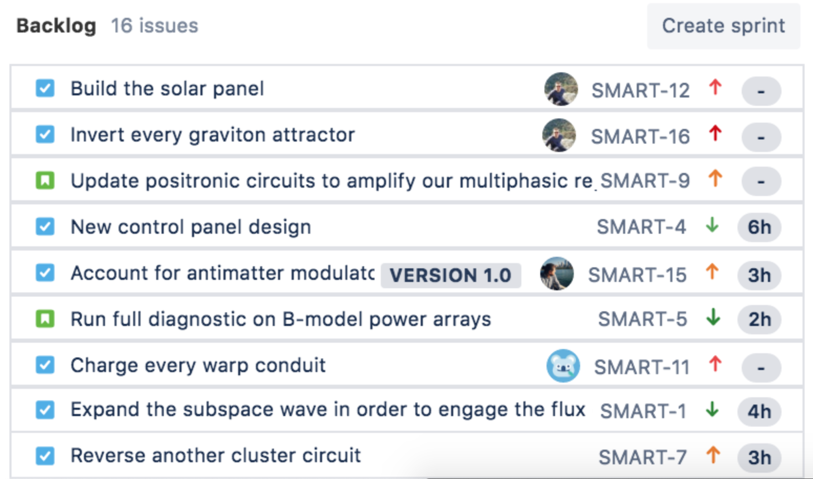

# ISDM Report

## Introduction
This report details the plan to create and implement a new call management system for a travel business. This system when implemented properly will increase the efficiency of the call centre by cutting down wait times ensuring their experience is as seamless as possible. 

The system will have three major components. A database where customer/company profiles and data can be securely stored and accessed. An inbound/outbound call management component where calls will diverted to the most appropriate RM based on the customer profile and the RM profile. Lastly, it will also contain a management app where company managers can access and review the performances of their team/s.

## Objectives
- Improve Customer Experience
- Increase CMC Effciency
- Monitor and Review RM Performance

## Problem Definition

<!-- Use the Empathy Maps we have to create Point of View statements and translate into a combined problem defintion, this only need to be high-level, maybe a few sentences?  -->
The current system has inbound customer calls diverted to any available RM without regard to expertise or experience. This creates a bottleneck when a customer with a specific request is paired with a RM that doesn't have the requisite expertise/experience. Resulting in an increase in customer waiting time as well as a decrease of customer satisfaction. 

On the outbound end, currently a RM would blindly call a customer without any knowlegde of their needs or interests, this generates issues as that specific RM may not have the necessary knowlegde or language to properly communicate with the potential customer, resulting in a decrease of sales effciency.

Finally, as of now Managers do not have a concrete grading system to review the performance of their team/s, this results in a decrease of efficiency in the CMC as manages cannot correctly identify the RMs that have a lower sales rate.

## Key Stakeholders
- Outbound Customers (Potential Customer)
- Inbound Customers (Current Customers)
- Board Members/Executives
- Employees/Potential Employees
- Company Managers

## Design Thinking Approach

<!-- Ideation from the above sections (stages 1 and 2 of the design thinking process), 200-300 word reflections and brainstormed ideas; stating any assumptions made. -->
### Empathy Maps
In order to fully grasp the needs of the CMC empathy maps of the key stakeholders have been generated.

#### 1. Outbound Customers

#### 2. Inbound Customers

#### 3. Board Members
\
#### 4. Employees/ Potential Employees

#### 5. Company Managers

Interpreting the Point of Views generated by the empathy maps, it is clear that the system must be able to securely store all the customer and RM profile information. It will also require some form of administration component allowing a user to add or remove certain profiles.
## Scrum

<!--
This is a section we can iterate over until we are ready to submit.
We need to define Scrum and any Scrum activities that we used along the way (like Standups, Retrospectives, etc.)
 -->

Being a part of the agile family of methodologies, Scrum is incremental and iterative. It achieves both incrementality and iteration through the use of "sprints", which are a key term and process used in the Scrum methodology. Scrum is commonly used by software teams, however, in recent years Scrum has branched out and found a place in non-software teams like sales (Solingen, Sutherland, and de Waard, 2010).

> Strategically implementing Scrum into sales and account management has lead to escalating revenue and a sustainable competitive advantage. (Solingen, Sutherland, and de Waard, 2010)

<!-- This paragraph may need to be removed to save space and reduce word count. -->

Scrum exists in the agile landscape alongside other methodologies like Extreme Programming (XP) and Kanban. Whilst they are all iterative,
they achieve it differently. Scrum has strict and succinct processes and roles, Kanban attempts to remove impedance from the iteration through the lack of process, and XP is heavily geared towards software development and software teams.

Scrum as a concept can be broken down into four sections: processes/concepts, ceremonies, tools, and roles.
For this report, only the first three will be covered.

### Processes/Concepts

#### Sprints

Sprints are a core concept in Scrum, they are short-lived or timeboxed period in which the scrum team completes a set of allocated work.
Common durations for sprints are 2, 3 or weeks for each iteration.

#### Backlog

A backlog can be thought of as an ordered project board or task list. A backlog is a log of tasks, usually but not always in the form of a user story (_As a x, I want y, So that z_).

Included below is a sample backlog being used in [Jira](https://www.atlassian.com/software/jira).

### Ceremonies

#### Sprint Planning

The purpose of sprint planning is to define and set up the next sprint, this includes; assigning tasks so specific team members, estimating tasks, and agreeing on the acceptance criteria. Sprint planning is done by the entire scrum team.

#### Daily Stand-up

The daily stand-up is what glues the team together and helps keep team members in sync. A standup usually only lasts for a few minutes (depending on the size of the team) and involves the scrum team members elaborating on the state of their current and upcoming tasks. It's usually where team members call out any "blockers", in which the product owner is there to listen and help unblock them.

#### Sprint Reviews

Reviews occur towards the end of sprints (sometimes multiple times during the sprint!), it is where the scrum team and interested stakeholders come together to showcase the work outputs from the current sprint. Sprint reviews are a great way to show your customer the progress your scrum team has been making.

#### Retrospectives

Retrospectives nearly always occur at the end or beginning of the next sprint. This ceremony is where the tech team (the product owner is not optional in a retrospective) collaborate on the questions similar to the following:

1. What went well?
2. What didn't go well?
3. What have I learned?
4. What still puzzles me?

Once these questions are answered, the team work together to create actions that are addressed over the coming sprints.

### Tools

A multitude of tools exist to help teams practise Scrum. You do not **need** tools to operate as a Scrum team, you could choose to simply use a whiteboard and sticky-notes for your backlog and tracking needs.

For this report, our team have been using Github, and more specifically, the issues section as our Backlog. Many teams gravitate towards a more agile focused solution like [Jira](https://www.atlassian.com/software/jira) or [Trello](https://trello.com/home).

In software teams specifically, the practice of Continuous Integration and Continuous Delivery (CI/CD) is heavily encouraged.

### How we used Scrum

Specifically, in our team, we have been having adhoc **standups** through the week where we have discussed what we are currently working on, and when possible related that back to something in our Github **backlog**. We have been using the tutorials as a defacto **sprint review** session, where we review PR's, discuss and elaborate on our tasks, and then show our customer (the tutor) our progress.

## Assumptions

To effectively outline the characteristics of the project, key elements that were not included in the initial assessment of the system needed to be logically assumed. Such assumptions were developed through a process of deliberation as to whether the assumed information would be relevant and potentially actionable in the current system.

The assumptions the team developed include:

1. Employees/Potential employee's empathy towards customers:
   It was not specified within the specifications however it would be assumed that Relationship Managers would be empathetic towards        customers (especially current customers) so as to provide better customer service and understand the needs of their clients more        wholly.

2. Scripts and Guidelines are not enough to assist and support customers’ queries:
   Customers cannot have their requirements met only through scripts and guidelines, it would seem a logical assumption to think that      the Relationship managers would need assistance from the system to provide extra information about each current customer, such as        notes kept about each customer made upon their first signing up with the company. 
   
   This could be done in the same way the 'target list' and 'customer profiles' are created, in that the customer's needs and              requirements will dictate the likelihood of purchasing the product, and in the same way will help RM's provide better services to the    customer.

3. RM's will relay customer improvement data straight from customers to managers:
   This is assumed as it is necessary to decipher the link between RM's relating improvement data from the customers to the Managers so    that improvements to the new system can be made. This ensures that the system continues to address the requirements of the customers. 

4. Board members and managers evaluate feedback as per a specific criteria in order to ascertain the most important requirements to        address:
   Developers cannot address every single issue that is given by the customers. As such a rigorous criteria would most likely be            implemented to priorities the most relevant requirements.

## Workproducts and models

<!-- Use-case diagrams, class diagrams, activity diagrams, etc. -->

## Competitive Advantages
The implemented information system will result in multiple competitive advantages by strengthening factors such as productivity and revenue whilst also reducing disadvantages such as operational costs. These costs are addressed by automating multiple tedious tasks inwhich the system does by using a using a 'skill level' measurement relying on age, sex, culture and language proficiency which is all calculated by the Profiler Tool. Furthermore, customers are measured by a score of 1-10 depending on preloaded criteria allowing the system to successfully match each customer to a suitable Relationship manager (RM). This is prominent in inbound calls as higher scored customers are served first preferably to higher skilled RMs. Thus, by capitalising customers with a higher chance of purchase to the most proficient RMs will result in a much higher chance of revenue and success. 

Revenue is also increased as operational costs from the role of manually directing customers to RMs becomes redundant, resulting in increased productivity as resources can be allocated towards other areas. Also, the system provides RMs with guidelines, scripts and preloaded customer criteria when undertaking outbound calls which give RMs opportunities to increase their skill level as it affected by sales performance and call-handling time resulting in increased productivity/work ethic. 

The company is also able to view employee growth or patterns with certain scored customers and possibly find methods to improve if able. The system also uses a scheduling system to dial RMs based on previous performance and call-time ensuring that RMs are not underworked or overworked. Finally, by introducing an Interactive Voice Response unit during peak times, the system specifies customers by presenting them with interactive options. By categorising these customers the system is able to match them with the next avaliable and best suited RM which reduces overall wait time and the chances of customers dropping out of queues due to these long wait times.
<!-- Discuss the competitive advantages our IS software has to the call centre (reducing cost, staff effectiveness, etc.) -->

## Consequences of IS Project Failure
Project failure would cause the complete opposite of competitive advantages as productivity and revenue would drop considerably with a substantial increase in operational costs. As failure of call flow control would result in the manual allocation of each customer to their suitable RM which is tedious, time consuming and error-prone. Also, project failure could cause loss of the target list resulting in inbound calls being directed to less viable RMs which produces lesser revenue as well as customer satisfaction due to mismatch of criteria or categories the RM may be specialised in. 

This same problem would occur within outbound calls having difficulties allocating skilled RMs to specific customers based on scores and criteria as well as not supporting these RMs with guides, scripts and customer information resulting in decreased chances of sales and longer call-handling times. Finally, without the systems Interactive Voice Response Unit, in peak times customers would have to be manually categorised and allocated resulting in longer wait times and customer dissatisfaction. Thus, system failure would compromise the entire business as the simple loss of call flow control itself would delay the system substantially whilst creating more disorder and confusion between RMs and end-customers.

## Conclusion

## References

- van Solingen, R., Sutherland, J., & de Waard, D. (2011). Scrum in Sales: How to Improve Account Management and Sales Processes. 2011 Agile Conference, 284–288. https://doi.org/10.1109/AGILE.2011.12

This section may not be needed, we can remove before subimission.

## Apendix

This section may not be needed, we can remove before subimission.
